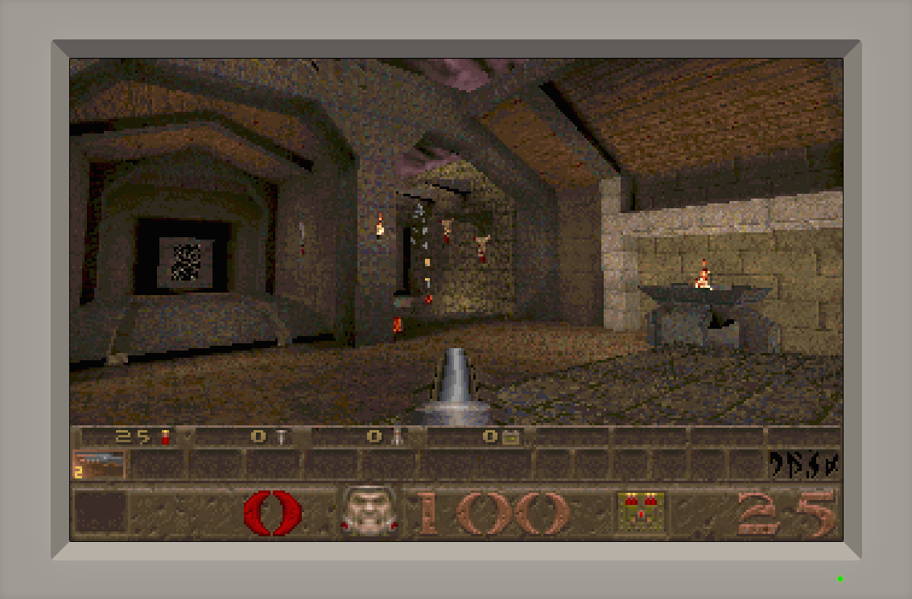

# THS Web DOSBox

A simple user interface for JS-DOS (a port of DOSBox for browsers); made originally for showcasing Tarpeeksi Hyvae Soft's DOS programs on the web.

This app provides the following:
1. A JavaScript API for defining a set of containerized DOS programs 
2. A URL hash interface for running one of the containerized programs in JS-DOS (e.g. `http://localhost/dosbox/#quake`)
3. A styled HTML container for the JS-DOS canvas with dynamic resizing to an integer multiple



# Usage

## Defining the containers

The following JavaScript file defines a set of DOS program containers.

```javascript
export default {
    "^quake/?$": {
        title: "Quake",
        zip: "./content/quake.zip",
        run: "quake.exe",
    },

    "^big-red-racing/?$": {
        title: "Big Red Racing",
        zip: "./content/brr.zip",
        run: ["cls", "racing.exe"],
    },

    "^flight-simulator-5.1/?$": {
        title: "Flight Simulator 5.1",
        zip: "./content/fs51.zip",
        run: "?run",
    },

    undefined: {
        // This container will be loaded if no others match the request. 
    }
};
```

The `zip` property gives the name of the ZIP file containing the program's data and executables as well as a `dosbox.conf` file providing the DOSBox parameters (e.g. cycles count) to be used when running the program.

The `title` property gives a string to be shown in the browser's title bar while running this program.

The `run` property sets the command(s) to be executed in DOSBox to run the container's program. Multiple commands can be given as an array. If this property is a string beginning with `?`, the rest of the string is interpreted as the name of a URL parameter providing the command(s); e.g. `http://localhost/dosbox/?run=['cd bin','cls','fs51.exe']#flight-simulator-5.1`.

The object keys are regular expressions that identify the hash URL associated with the corresponding content.

## Running a container

With the containers as defined above and the app hosted at `http://localhost/dosbox/`, you can run Quake by accessing the URL `http://localhost/dosbox/#quake` (or `http://localhost/dosbox/#quake/`, since the regular expression representing its hash URL allows a single trailing slash).

The app will fetch the `./content/quake.zip` file, load its contents into JS-DOS, and execute the `quake.exe` command inside JS-DOS.
